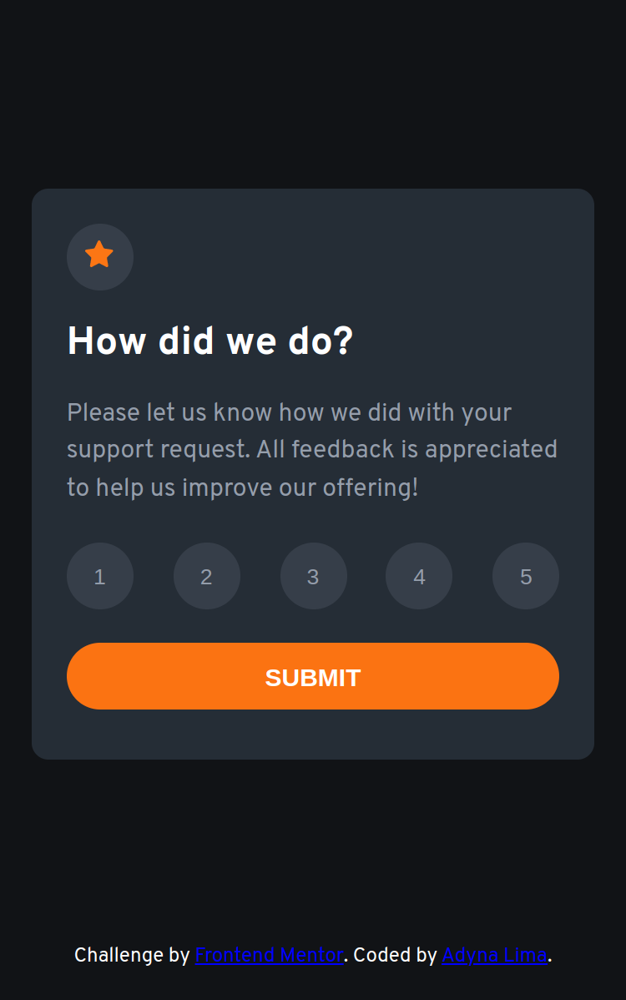
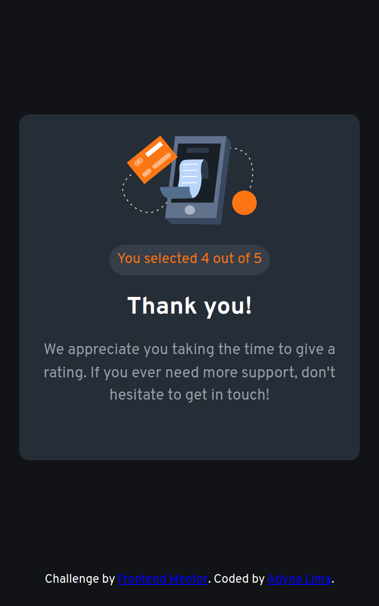
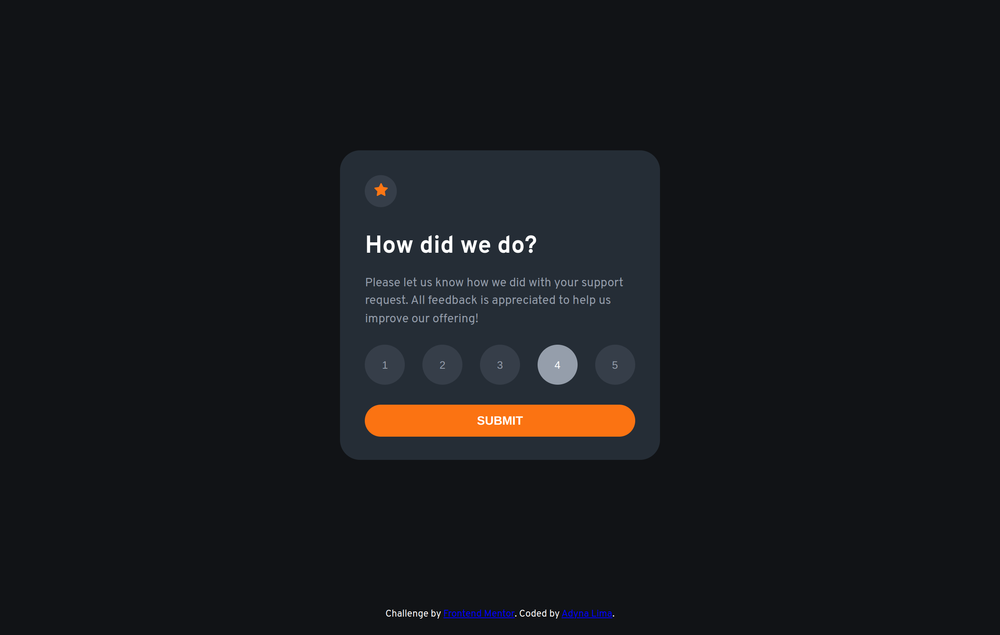
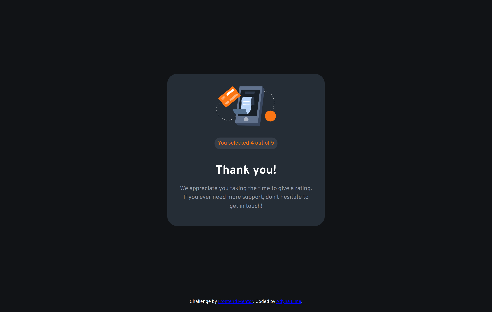

# Solução de componente de classificação interativa

Esta é uma solução para o [Desafio do componente de classificação interativa no Frontend Mentor], em que desenvolvi uma página para avaliação numérica de um serviço. 

## Tabela de conteúdo 

- [Visão geral](#visão-geral)
  - [O desafio](#o-desafio)
  - [Capturas de tela](#captura-de-tela)
  - [Links](#links)
- [Meu processo](#meu-processo)
  - [Tecnologias utilizadas](#tecnologias-utilizadas)
  - [O que aprendi](#o-que-aprendi)
  - [Status do projeto](#status-do-projeto)
  - [Recursos úteis](#recursos-úteis)
- [Autora](#autora)
-[Agradecimentos](#agradecimentos)
- [Licença](#licença)

## Visão geral

### O desafio

Os usuários devem ser capazes de:

- Ver o layout ideal para o aplicativo, dependendo do tamanho da tela do dispositivo (375px/1250px)
- Ver os estados de foco para todos os elementos interativos na página
- Selecionar e enviar uma classificação numérica
- Ver o estado do cartão "Obrigado" após enviar uma avaliação

### Captura de tela







### Links

- URL da solução: [GitHub](https://github.com/adynaslima/interactive-rating-component.git)
- URL do site: [Site](https://adynaslima.github.io/interactive-rating-component/)

## Meu processo

### Tecnologias utilizadas

- Marcação HTML5 semântica
- Propriedades personalizadas CSS
- Flexbox
- JavaScript
- Fluxo de trabalho móvel primeiro

### O que aprendi

```css
..botao-numeros {
    display: flex;
    flex-direction: row;
    justify-content: space-between;
    padding-bottom: 20px;
}
```

```js
enviar.addEventListener ("click", () => {
    cartao2.classList.remove("hidden")
    cartao1.style.display = "none"
})

nota.forEach((numero) => { 
    numero.addEventListener("click", () => {
        avaliacao.innerHTML = numero.innerHTML
    })
})
```

### Status do projeto

Em construção...

### Recursos úteis

- [Curso sobre JavaScript](https://www.cursoemvideo.com/curso/javascript/) - Esse curso me ajudou pelo motivo de o professor ser muito didático e ter um módulo específico sobre como entender o DOM. 

## Autora

- GitHub - [Adyna Lima](https://github.com/adynaslima)
- LinkedIn - [Adyna Lima](www.linkedin.com/in/adynalima)

## Agradecimentos 

Queria deixar registrado o meu agradecimento a Ana Carolina Bianchini pela ajuda no código, pela ajuda com os bugs e, sobretudo, pelo incentivo diário. 

## Licença

Esse projeto é licenciado pelo MIT. 

